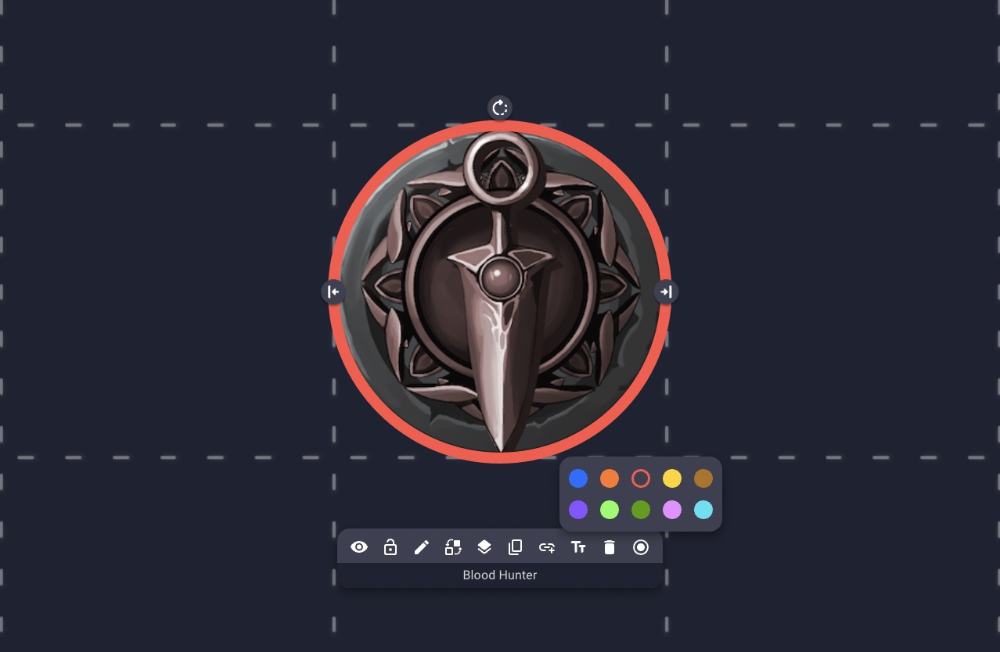

# Colored Rings

Add simple colored status rings to any character

## Installing

The extension can be installed from the [store page](https://extensions.owlbear.rodeo/colored-rings).

## How it Works

This project is a simple Typescript app.

The background script `background.ts` communicates with Owlbear Rodeo to create a context menu item. When that item is clicked a popup is shown with the `main.ts` site rendered.

## Building

This project uses [Yarn](https://yarnpkg.com/) as a package manager.

To install all the dependencies run:

`yarn`

To run in a development mode run:

`yarn dev`

To make a production build run:

`yarn build`

## License

GNU GPLv3

## Contributing

This project is provided as an example of how to use the Owlbear Rodeo SDK. As such it is unlikely that we will accept pull requests for new features.

Copyright (C) 2023 Owlbear Rodeo
